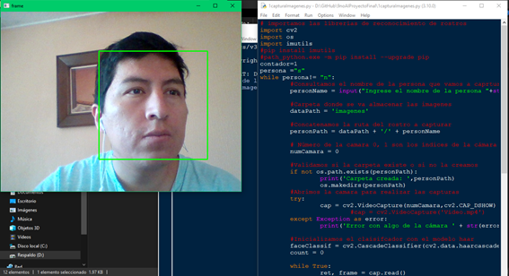

# Mini Proyecto Final

Proyecto de reconocimiento de rostros

# Materia:

 - Inteligencia Artificial

# Requerimientos:

 - Agregar funcionalidad, para que cada persona a ser ingresada indique su nombre. Pueden ser de 1 a 1000, cada uno debe colocar su nombre.
 - El entrenador, puede elegir de cualquier de las tres opciones detalladas y elegir por la situación que deberá justificar.
 - El reconocimiento facial deberá indicar el uno o el total de las personas (rostros) que aparezcan en la webcam.

# Curso:
 - Noveno "A" Sistemas de información

# Integrantes:

- Fabian Mauricio Diaz Analuisa
- Jefferson Jairo Benites Saenz
- Vinicio Fialdelfo Guaray Valdiviezo
- Marco Antonio Ayala Lituma

# Herramientas que se utilizo:
 - Python 3.10
 - IDLE Shell
 - GitHub

# Modo de Ejección:
 - Ejecutar el primer archivo (1 capturaImagenes.py) el cual solicita el ingreso de información de los nombres y captura de fotografias
 - Ejecutar el segundo archivo (2 entrenarImagen.py) el cual internamente toma todas las imagenes y entrenar al modelo para el reconocimientos de rostros.
 - Ejecutar el tercer archivo (3 probarImagenes.py) el resultado de reconocimiento en forma virtual con la camara y los rostros que se muestren sean reconocibles.

# Resultados:
 - Toma de información
 
 - Entrenamiento
 
 - Recocimientos
